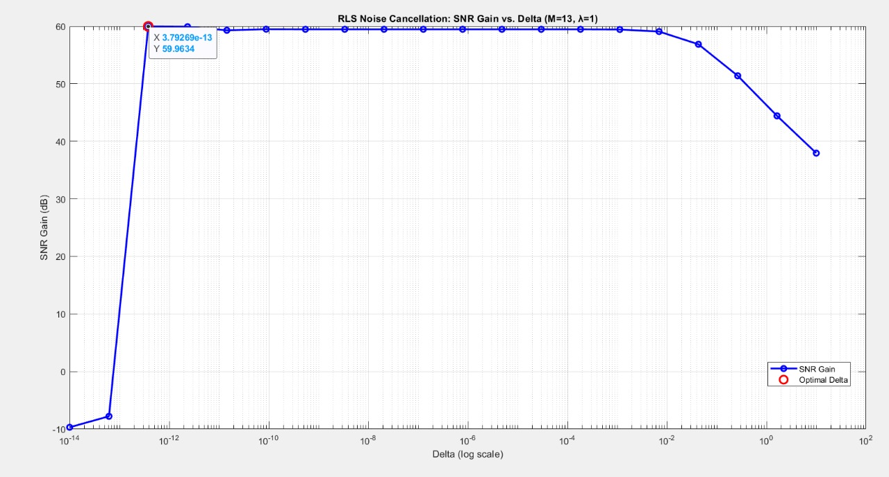

# Real-Time Noise Cancellation using LMS, NLMS, and RLS

This project is part of the EE2800 – Digital Signal Processing course at IIT Hyderabad. It implements adaptive filters to cancel noise from speech signals in real time. The final design leverages the **Recursive Least Squares (RLS)** algorithm for its superior convergence and noise suppression performance.

---

##  Problem Overview

Design a **programmable, selective noise canceller** that:

- Uses external noise measurements \( w(n) \) and noisy speech \( s(n) + v(n) \)
- Estimates and subtracts the leakage noise \( \hat{v}(n) \)
- Works in both:
  - **Full suppression mode**: cancels all external noise
  - **Partial suppression mode**: cancels only non-tonal noise

---

##  System Block Diagram


> 🔹 Components in green were designed.  
> 🔹 Notch Filter used for partial suppression.  
> 🔹 System simulates real-time by buffering inputs with minimal latency.

---

##  Algorithms Implemented

- **LMS (Least Mean Squares)**: Simple, slow convergence  
- **NLMS (Normalized LMS)**: Scaled adaptation, moderate convergence  
- **RLS (Recursive Least Squares)**: Fastest convergence, lowest steady-state error

The RLS algorithm was selected for the final system.

---

##  Design Insights (from Experiments)

###  Filter Order (M)
  
**Best performance at M = 13**

###  Forgetting Factor (λ)
  
**Optimal λ = 1**, yields best balance between memory and responsiveness

###  Initialization Parameter (Δ)
  
**Best Δ ~ 3.79×10⁻¹³** achieves highest SNR gain

---

##  Convergence & Comparison

### Absolute Error vs Iterations and SNR vs Iterations


>  LMS |  NLMS |  RLS  
> RLS clearly outperforms LMS and NLMS in error reduction and SNR gain

---

##  Audio Results

### NLMS Output vs Ground Truth


### RLS Output vs Ground Truth


---

##  Parameter Sweep – NLMS

### Step Size (μ) vs SNR Gain


> **Optimal μ = 0.005**

---

##  RLS Algorithm Details

- **Error Function**:  
  \( E(n) = \sum_{i=0}^{n} \lambda^{n-i} e^2(i) \), where \( e(i) = d(i) - w_n^T x(i) \)

- **Weight Update**:  
  \( w_n = w_{n-1} + g(n)\alpha(n) \)

- **Gain Vector**:  
  \( g(n) = \frac{P(n)x(n)}{\lambda + x^T(n)P(n)x(n)} \)

- **Error**:  
  \( \alpha(n) = e(n) - w_{n-1}^T x(n) \)

###  Notch Filter for Partial Suppression

Transfer Function:  
\[
H(z) = \frac{1 - 2\cos(\omega_0)z^{-1} + z^{-2}}{1 - 2r\cos(\omega_0)z^{-1} + r z^{-2}}
\]

Difference Equation:
\[
y(n) = a_1 y(n-1) - a_2 y(n-2) + b_0 x(n) - b_1 x(n-1) + b_2 x(n-2)
\]

---

##  Repository Structure

```

real-time-noise-cancellation/
├── lms/                   # LMS implementation
├── nlms/                  # NLMS implementation
├── rls/                   # Final RLS system
├── OUTPUT/                # SNR, filter weights, outputs
├── speeches/              # speech inputs
├── images/                # Generated graphs
├── DesignReview/          # REview of project and design
├── problems\_statements  
└── README.md              # This file

````

---

##  Running the Code

1. Clone the repo:
   ```bash
   git clone https://github.com/yourusername/real-time-noise-cancellation.git
   cd real-time-noise-cancellation
```

2. Run in MATLAB:

   ```matlab
   run('rls/main.m')  % or lms/main.m, nlms/main.m
   ```

---

##  Key Takeaways

* RLS significantly outperforms LMS and NLMS in convergence and suppression
* Optimal parameters determined through empirical analysis
* System meets both full and partial suppression goals with configurable filters

---

##  References

* M. H. Hayes, *Statistical Digital Signal Processing and Modeling*, Wiley, 1996
* P. S. R. Diniz, *Adaptive Filtering: Algorithms and Practical Implementation*, Springer, 2020

---

##  License

This project is part of the IIT Hyderabad EE2800 course and is intended for academic use only.

```

---

Let me know if you’d like to include [audio playback links](f), [code annotations](f), or a [PDF export of the README](f).
```
